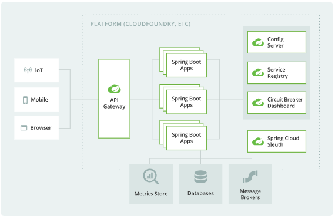
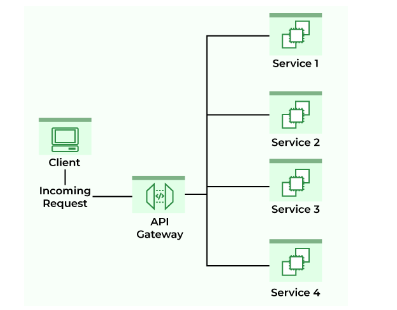

# Development microservices steps

### Reference Documentation

les references:

* https://www.tutorialspoint.com/spring_boot/spring_boot_eureka_server.htm
* https://spring.io/guides/gs/gateway
* https://spring.io/microservices
* [Official Apache Maven documentation](https://maven.apache.org/guides/index.html)
* [Spring Boot Maven Plugin Reference Guide](https://docs.spring.io/spring-boot/docs/3.2.2/maven-plugin/reference/html/)
* [Create an OCI image](https://docs.spring.io/spring-boot/docs/3.2.2/maven-plugin/reference/html/#build-image)

#### étapes: 
1- creation du projet "AppGuideTouristique" en utilisant jetbrains sans ajout d'aucune dependence
2- creation du module api-gateway-service 
 

- ces sont les dependances necessaires:
```
api-gateway-service
spring-cloud-starter-gateway-mvc
spring-cloud-starter-netflix-eureka-client
spring-cloud-dependencies
  ```
- les dependances ajouté dans pom.xml sont:
```
         <dependency>
            <groupId>org.springframework.cloud</groupId>
            <artifactId>spring-cloud-starter-gateway-mvc</artifactId>
         </dependency>
         <dependency>
            <groupId>org.springframework.cloud</groupId>
            <artifactId>spring-cloud-starter-netflix-eureka-client</artifactId>
         </dependency>
         <dependency>
                <groupId>org.springframework.cloud</groupId>
                <artifactId>spring-cloud-dependencies</artifactId>
                <version>${spring-cloud.version}</version>
                <type>pom</type>
                <scope>import</scope>
         </dependency>
```
3- creation du module discovery-service:
- la dépendance du serveur Spring cloud Eureka qui doit étre ajoutée dans pom.xml
```
<dependency>
<groupId>org.springframework.cloud</groupId>
   <artifactId>spring-cloud-starter-eureka-server</artifactId>
</dependency>
```
- Par défaut, le serveur Eureka s’enregistre dans la découverte. Alors on doit configurer le fichier application.properties.yml pour doit étrecomme ça:
```
server.port = 8761
eureka.client.registerWithEureka = false
eureka.client.fetchRegistry = false
```

## categoryservice
### architecture MVC
model
repository
controllers
pour l'ajout des fonction dans un classe il faut utiliser Repository
